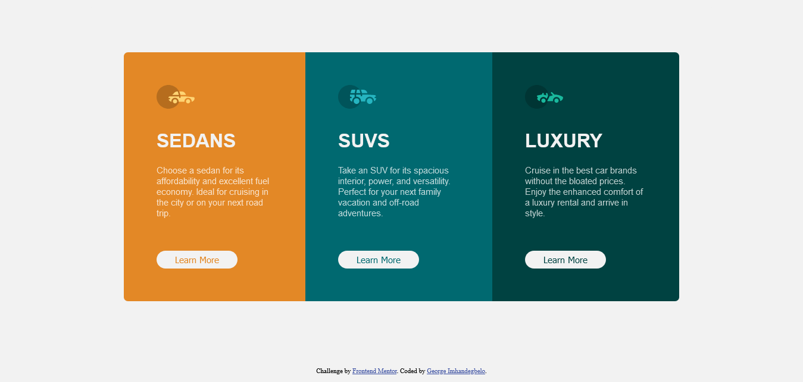

# Frontend Mentor - 3-column preview card component solution

This is a solution to the [3-column preview card component challenge on Frontend Mentor](https://www.frontendmentor.io/challenges/3column-preview-card-component-pH92eAR2-). Frontend Mentor challenges help you improve your coding skills by building realistic projects. 

## Table of contents

- [Overview](#overview)
  - [The challenge](#the-challenge)
  - [Screenshot](#screenshot)
  - [Links](#links)
- [My process](#my-process)
  - [Built with](#built-with)
  - [What I learned](#what-i-learned)
- [Author](#author)


## Overview

### The challenge

Users should be able to:

- View the optimal layout depending on their device's screen size
- See hover states for interactive elements

### Screenshot



### Links

- Solution URL: [Solution](https://my-solution-url.com)
- Live Site URL: [Live site](https://imhandegbelo.github.io/3-column-preview-card-component-main/)

## My process

### Built with

- Semantic HTML5 markup
- CSS custom properties
- Flexbox

### What I learned

This project - as simple as it may look - thought me how to use the CSS Flexbox. I had no knowledge of that prio to this project as I always used bootstrap to simplify things. I'm glad I knnow how to use flexbox now

An illustration of flexbox:

```html
<h1>Some HTML code I'm proud of</h1>
<div class="big-box">
  <div class="small-box">
    This box is smaller
  <div>
  <div class="small-box">
    Another small box
  <div>
</div>
```
```css
.big-box {
  display: flex;
}
```

## Author

- Frontend Mentor - [@imhandegbelo](https://www.frontendmentor.io/profile/imhandegbelo)
